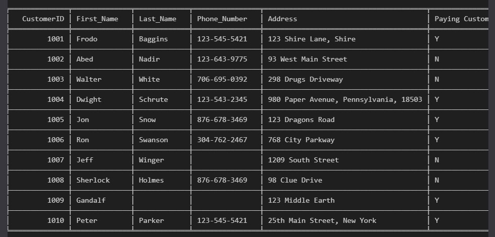

# Lista de chamadas de clientes – Projeto de Limpeza de Dados

## Sobre o Projeto:

Este projeto tem como objetivo realizar a limpeza e padronização de uma base de dados contendo informações de clientes para contato telefônico.

O foco principal foi aplicar técnicas de **Data Cleaning** utilizando Python e Pandas, garantindo que os dados estejam prontos para uso em análises ou campanhas operacionais.

---

## Objetivos:

- Remover registros duplicados
- Eliminar colunas desnecessárias
- Padronizar nomes e telefones
- Tratar valores ausentes
- Dividir campos compostos (ex: endereço)
- Padronizar variáveis categóricas (Yes/No → Y/N)

---

## Tecnologias Utilizadas:
- Jupyter
- Python
- Pandas
- Openpyxl

---

## Etapas do Processo:

### 1 Remoção de Duplicatas
Eliminação de registros repetidos para evitar redundância e inconsistências.

### 2 Limpeza de Colunas
Remoção de colunas irrelevantes para análise.

### 3 Padronização de Nomes
Remoção de caracteres especiais indesejados nos sobrenomes.

### 4 Limpeza e Formatação de Telefones
- Remoção de caracteres não numéricos
- Padronização para o formato: `XXX-XXX-XXXX`

### 5 Separação de Endereço
Divisão da coluna `Address` em:
- Street_Address
- State
- Zip_Code

### 6 Padronização de Variáveis Binárias
Conversão de:
- Yes → Y
- No → N

### 7 Tratamento de Valores Ausentes
Substituição de valores como:
- N/a
- NaN
- Campos vazios

---

## Resultado:

A base final está:
- Organizada
- Padronizada
- Livre de duplicidades
- Pronta para análise ou uso operacional

---

## Aprendizados

Este projeto reforçou a importância da qualidade dos dados antes de qualquer análise.

Sem dados limpos:
- Análises ficam imprecisas
- Decisões podem ser incorretas
- Processos operacionais são prejudicados

